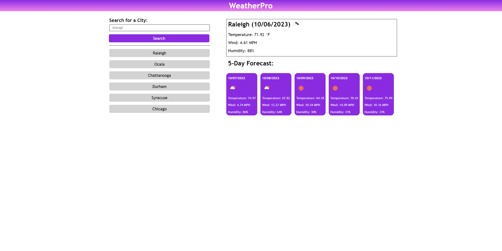

# WeatherPro

## Description

Introducing WeatherPro, a cutting-edge Weather Dashboard app that provides comprehensive and accurate weather insights for any city in the United States. WeatherPro is your go-to solution for staying informed and prepared for any weather conditions.

With WeatherPro, you can easily view the current weather conditions, including temperature, humidity, wind speed, and precipitation. The user-friendly interface makes it simple to navigate and quickly access the information you need.

But WeatherPro doesn't stop at just current conditions. It also offers a detailed 5-day forecast, allowing you to plan your week ahead with confidence. Whether you're scheduling outdoor activities, travel plans, or just want to know what to wear, WeatherPro has you covered with accurate and up-to-date forecasts.

One of the standout features of WeatherPro is its real-time weather alerts. If severe weather is headed your way, you'll receive timely notifications to help you stay safe and make informed decisions.

WeatherPro also includes stunning weather maps and radar images that give you a visual representation of weather patterns and potential storms in your area. With these tools at your fingertips, you can track weather developments and stay one step ahead of Mother Nature.

Whether you're a weather enthusiast or just want a reliable and easy-to-use weather app, WeatherPro is the perfect choice. Download WeatherPro today and experience the convenience and peace of mind that comes with having a powerful Weather Dashboard in your pocket!

## MockUp

## Deployed Site

 https://caitlinramsey.github.io/weather-forecast/ 
